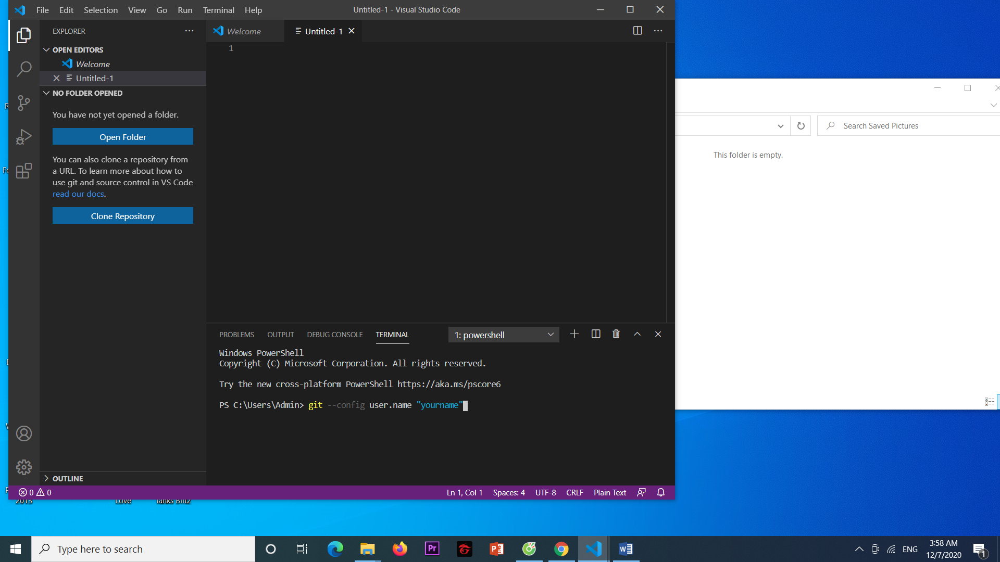

# gitandgithubturtorial.github.io
<html>
    <head>
        <h2>Overview</h2>
    </head>
    <body>
        
Basically, Git is a software help you to control any change in files or sets when you doing a project with 3 or more people.

        
Github is a place that contains git repositories whether you want to create a project so everyone in your team can code and fix though out the project.

        
For more information, click on the link below:

        
Git: <a href="https://en.wikipedia.org/wiki/Git">git</a>.

        
Github: <a href="https://en.wikipedia.org/wiki/GitHub">Github</a>.

    </body>
    <head>
        <h2>How to install Git and Github</h2>
    </head>
    <body>
        
First, you need to go to <a href="https://git-scm.com/downloads">Git</a> and click download depend on your laptop or computer.

        
        
After download it, you will set it up. Just folowing those step until it install to your device

        
        
About Github, you need to go to <a href="https://desktop.github.com/">here</a> and choose to download for Window or MacOS

        
After download,folow it process to install

        
You will need your Github account to log in and use it so if you don't have it you can use <a href="https://github.com/join?source=header-home">this link</a>.

    </body>
    <head>
        <h2>Basic Git command</h2>
    </head>
    <body>
        
Git config: this is a first step you need to do when you use Git at the first time. You will need to type your user name and email so git will recognise you each time you add sth to the repository

        
        
        
Git add: this is the command when you need to add your code to the repository.

        
Git clone: this command will help you copy all the file from your repository from global to your device. Take note that you can only copy once, the next time you need an update you will use command Git pull.

        
Git pull: update changes from repository

        
Git commit: note change you want to show when put it to repository

        
Git push: you put your change to repository

    </body>
</html>

